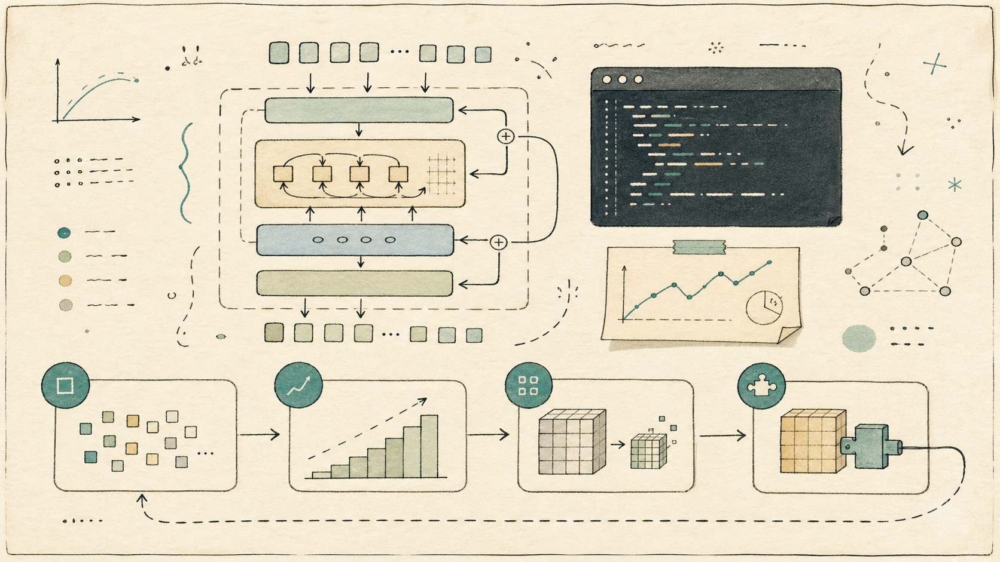

# Parameter Golf Lab



A small, practical PyTorch lab for learning how compact language models are built, trained, measured, compressed, and adapted.

This project is inspired by OpenAI's Parameter Golf challenge and the progressive context-growth / score-first TTT lineage around PR #2014. It is **not** a leaderboard reproduction. The goal is to make the ideas approachable enough for a classroom, workshop, or self-guided weekend project.

Live visual guide: [https://heng-xiu.github.io/parameter-golf-lab/](https://heng-xiu.github.io/parameter-golf-lab/)

## What You Will Learn

- How a tiny causal Transformer is assembled in PyTorch
- Why byte-level bits per byte (BPB) is useful for model evaluation
- How grouped-query attention changes query/key/value shapes
- Why progressive context growth is a compute-budget strategy
- How checkpoint size, parameter count, and artifact size differ
- What simple int8 and fake-int4 quantization do to model quality
- How a low-rank residual can reduce quantization error
- Why score-first test-time training avoids future-token leakage
- Why chat behavior needs dialogue-formatted data, not just web text

## Who This Is For

This repo is designed for learners who know basic Python and have seen PyTorch tensors or training loops before. You do not need experience with GPTQ, LQER, FlashAttention, Triton, Muon, distributed training, or competition compression tricks.

The default path runs on CPU. Apple Silicon users can train faster with MPS by passing `--device mps`.

## Quick Start

```bash
git clone https://github.com/Heng-xiu/parameter-golf-lab.git
cd parameter-golf-lab
make setup
make smoke
```

Expected output:

```text
step=20 seq_len=64 loss=... bpb=...
saved=outputs/baseline/checkpoint.pt
parameters=...
checkpoint_bytes=...
```

`make setup` creates a local `.venv`, installs runtime and development dependencies, and installs the package in editable mode.

## Run the Baseline

Create the tiny teaching corpus, train a byte-level Transformer, evaluate it, and inspect model size:

```bash
python scripts/make_tiny_corpus.py --out data/tiny.txt
python scripts/train.py --config configs/baseline.yaml
python scripts/evaluate.py --checkpoint outputs/baseline/checkpoint.pt
python scripts/report_size.py --checkpoint outputs/baseline/checkpoint.pt
```

The baseline intentionally overfits a tiny corpus. That is useful: it lets you inspect the mechanics quickly before moving to larger data.

## Try the Core Experiments

Progressive context growth:

```bash
python scripts/train.py --config configs/progressive_context.yaml
```

The log prints `seq_len=...`, so you can see the active context length change over training.

Grouped-query attention:

```bash
python scripts/train.py --config configs/gqa.yaml
```

Quantization and low-rank correction:

```bash
python scripts/quantize.py --checkpoint outputs/baseline/checkpoint.pt --method int8
python scripts/quantize.py --checkpoint outputs/baseline/checkpoint.pt --method int8-lowrank --rank 4
```

Score-first LoRA test-time training:

```bash
python scripts/run_ttt.py \
  --checkpoint outputs/baseline/checkpoint.pt \
  --config configs/ttt_lora.yaml
```

The TTT log includes `scored_before_update=true`. That is the important rule: score the current chunk before adapting on it.

## Apple Silicon Training

On an M-series Mac, use MPS:

```bash
python scripts/train.py \
  --config configs/baseline.yaml \
  --device mps \
  --output-dir outputs/mps_baseline \
  --max-steps 300
```

Chat with the trained checkpoint:

```bash
python scripts/chat.py \
  --checkpoint outputs/mps_baseline/checkpoint.pt \
  --device mps
```

Do not expect this baseline checkpoint to chat well. It was trained on simple teaching text, not dialogue.

## Chat Quality Tutorial

For chat behavior, train on dialogue-formatted data:

```bash
python scripts/make_tiny_chat_corpus.py --out data/tiny_chat.txt
python scripts/train.py --config configs/chat_tiny.yaml --device mps
python scripts/chat.py \
  --checkpoint outputs/chat_tiny_mps/checkpoint.pt \
  --device mps \
  --allowed-text data/tiny_chat.txt \
  --chat-template \
  --stop-at-user
```

For a better classroom demo, export a small Hugging Face chat corpus:

```bash
python -m pip install -r requirements-hf.txt
python scripts/export_hf_chat_corpus.py \
  --out data/hf_chat.txt \
  --max-examples 1200
python scripts/train.py --config configs/hf_chat_mps.yaml --device mps
python scripts/chat.py \
  --checkpoint outputs/hf_chat_mps/checkpoint.pt \
  --device mps \
  --allowed-text data/hf_chat.txt \
  --chat-template \
  --stop-at-user
```

This still produces a tiny byte-level model. It teaches the relationship between data format and behavior; it is not a general assistant.

## Visual Tutorial Site

The repo includes a Vite tutorial site that summarizes the hands-on path.

Run it locally:

```bash
make site-setup
make site-build
make site-test
make site-dev
```

Then open the URL printed by Vite.

The published version is here:

[https://heng-xiu.github.io/parameter-golf-lab/](https://heng-xiu.github.io/parameter-golf-lab/)

## Lesson Path

1. [Tiny Causal LM](docs/lessons/01_tiny_lm.md)
2. [Progressive Context Growth](docs/lessons/02_progressive_context.md)
3. [GQA and KV Cost](docs/lessons/03_gqa.md)
4. [Quantization](docs/lessons/04_quantization.md)
5. [Low-Rank Quantization-Error Correction](docs/lessons/05_lowrank.md)
6. [Score-First LoRA TTT](docs/lessons/06_ttt.md)
7. [Chat Quality](docs/lessons/07_chat_quality.md)

See the [experiment matrix](docs/experiment_matrix.md) for suggested comparisons.

## Quality Checks

Before changing the repo, run:

```bash
make format
make lint
make typecheck
make test
make smoke
make site-build
make site-test
```

Generated data, checkpoints, logs, virtualenvs, and frontend build output are ignored by git.

## What Is Included

Included:

- Byte tokenizer and BPB metric
- Tiny causal Transformer
- RoPE causal attention
- MHA, GQA, and MQA shape support
- Progressive context schedule parser
- Model-size reporting
- Tensor-wise and per-channel int8 quantization
- Fake int4 quantization path
- Truncated-SVD low-rank residual correction
- LoRA injection helpers
- Score-first TTT loop
- Optional Hugging Face chat-corpus exporter
- Vite tutorial site

Simplified:

- Quantized checkpoints dequantize for ordinary PyTorch forward passes
- Low-rank correction is a teaching SVD residual, not full LQER
- TTT is intentionally small and document-local

Omitted from the baseline:

- CUDA-only kernels
- FlashAttention
- Triton
- Distributed training
- Full GPTQ
- Full LQER
- Muon
- Leaderboard-specific compression pipelines

## Repository Layout

```text
src/mini_pgolf/      PyTorch package
scripts/             runnable training, eval, quantization, chat scripts
configs/             small YAML experiment configs
tests/               focused pytest coverage
docs/lessons/        step-by-step lesson notes
tutorial-site/       Vite visual tutorial site
data/                generated corpora, ignored except .gitkeep
outputs/             generated checkpoints, ignored except .gitkeep
```

## License and Attribution

This is a teaching adaptation inspired by the public Parameter Golf challenge. It does not include the upstream leaderboard solution or competition artifacts.
